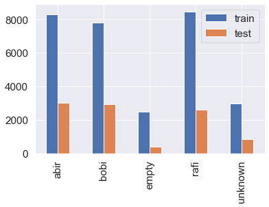

# Web Based Home Security

**List of Topics**:

## Datasets

For this project we use 5 real environment images using Nikon DSLR camera. For each subject we take ~10000 images. 

## Model Benchmark Reports

Here we use three top convolutional neural network based model, `Inception V3`, `Vgg16` and my `custom cnn model`. In the `./Notebooks/` you can find the three seperate models that we use our training data.

## Web Application

Here we create a simple django based web application to present how the deep learning secure you works, home environment over the internet. 

## Results and Dicussions

